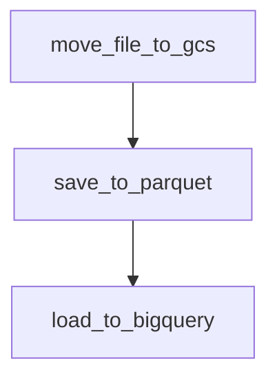

# Data Engineering Zoomcamp

This repo is my [data engineering zoomcamp](https://github.com/DataTalksClub/data-engineering-zoomcamp) project to improve my skills in various topics.
- Workflow Orchestration
- Data Lake (Google Cloud Storage)
- Data Warehouse (Google BigQuery)
- Spark (PySpark)

## Here is the workflow diagram

## Tasks
__move_file_to_gcs__ - Download compressed json files from source ([github archive](http://gharchive.org)) and upload to google cloud storage.

__save_to_parquet__ - Create Spark DataFrame from compressed json files on google cloud storage, turn into parquet and upload back to google cloud storage.

__load_to_bigquery__ - Insert data from parquet files to partitioned table on BigQuery.